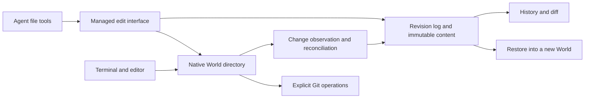

# Continuous work history for agents

The proposed filesystem revision/root model is now specified in the
[userspace filesystem design](USERSPACE_FILESYSTEM_DESIGN.md). This document retains the earlier
observation-based work-history proposal; its partial work revisions must not be confused with the
new immutable filesystem-root revisions. Neither model promises to capture every application write.

macOS follow-up work must use the [mounted-filesystem redesign](MACOS_FILESYSTEM_REDESIGN.md).
Its mandatory mount and private backing replace this proposal's native-path assumption on macOS;
filesystem integration still does not promise a revision for every userspace write.

Status: proposed design, 2026-10-05. This document does not introduce a new command,
storage schema, daemon, or execution backend. Implementation and numerical defaults
require validation before becoming part of the product contract.

## Purpose

An agent can read and rewrite files many times before producing a useful Git commit.
Worlds should retain that work as lightweight revisions linked to tool calls and
conversation turns. Git commits remain explicit delivery milestones; normal file
reads remain on the native filesystem path.

This proposal draws on Zed's public Delta documentation: DeltaDB records edits and
conversation changes between commits, while terminal tools operate in materialized
checkouts. It describes a forkfs design, not a reproduction of DeltaDB's unpublished
storage internals. References are listed below.

## Three levels of history

| Level | Contents | Creation |
| --- | --- | --- |
| Work revision | Recorded file changes and their provenance | Automatic, per tool operation or observation batch |
| World checkpoint | Complete tree under the existing checkpoint contract | Explicit save or important workflow boundary |
| Git commit | Selected source changes and a commit message | Explicit Git operation |

A task may produce hundreds of revisions, a few checkpoints, and one commit. A
revision is not a complete World checkpoint. It cannot restore Git administrative
state, excluded build outputs, or running processes.

Calling the existing whole-tree checkpoint operation after every save would repeat
Git validation and tree work. Continuous history needs a separate incremental path.
It must not relax existing checkpoint validation, including refusals for unsupported
Git states.

## Architecture



Keep the core as a C ABI with system-library dependencies, following arch.md §39.
A history service owns observation and batches metadata writes. It must not make
ordinary reads depend on a database round trip or interpose every filesystem syscall.
The existing filesystem remains the live working surface. Immutable revisions are
historical representations, not an asynchronously competing second live authority.

### Managed edits

An optional agent file-tool adapter provides read/edit/write operations with
`world_id`, `tool_call_id`, and an expected content version. One tool operation can
produce one revision containing several file changes. Its actor and conversation
association are supplied explicitly by the adapter.

A managed read records the exact bytes returned and can return a version token.
Editing a stale version returns a conflict. However, checking a hash and then
renaming a file is not a filesystem compare-and-swap: arbitrary external writers
can race between those operations. Strict conditional writes require exclusive
writer control. A cooperative lock is sufficient only when all writers honor it.
An observation-mode World must not advertise that stronger guarantee.

Concurrent managed operations are serialized per World for revision publication.
External changes are reconciled as separate observations; preserve both recorded
versions when a conflict is detected rather than silently relabeling the external
change as an agent edit.

### External writes

Shell commands, editors, formatters, and compilers continue to use ordinary paths.
On macOS, reuse the principle in core/src/events.h: events identify candidates,
then content is inspected. Linux needs its own observer, overflow handling, and
reconciliation strategy; this proposal does not claim they already exist.

Notifications can coalesce or be lost. A file changed from A to B to C may only be
observed as A to C. A subsequent full scan recovers current observable content, not
missing intermediate versions. Short-lived files can disappear before observation.

Therefore external writes provide sampled state history, not a lossless syscall
log. No actor attribution is inferred merely from temporal overlap with an agent.
External observations use an unknown actor unless an independent source establishes
provenance.

Observation reads must avoid following symlinks outside the World and check file
identity and mutation before/after capture. Those checks detect many races but do
not prove a coherent read against an uncooperative writer. A continuously changing
file is deferred or marked incomplete. An observation batch is not a simultaneous
multi-file snapshot. Strict snapshots require controlled writers or a separately
validated filesystem snapshot mechanism.

Capturing every intermediate arbitrary write requires a compulsory mediation
mechanism. It is a separate architectural project, not an FSEvents feature.

## Data model

Conceptual records, not a committed schema:

```text
Revision
  id, world_id, parent_revision, root_manifest
  actor_id?, turn_id?, tool_call_id?
  origin: tool | filesystem | restore
  coverage: mediated | observed | incomplete
  capture_started_at, capture_finished_at

Change
  revision_id, file_id
  old_path?, new_path?
  before_content?, after_content?
  file_kind, executable_bit

Content
  content_hash -> immutable bytes

ReadReference (optional)
  tool_call_id, file_id, content_hash, byte_range

GitContext (optional)
  revision_id, observed_head, observation_time
```

Use stable revision IDs rather than timestamps for addressing history. A per-World
single-writer sequence establishes publication order; observed filesystem order is
not claimed to be actual write order. A persistent directory manifest references
content objects and shares unchanged subtrees between revisions.

File identity is logical. Explicit managed renames preserve file IDs. Observer-only
rename inference is advisory; ambiguous delete/create sequences must remain such.
An inode number is not a permanent identity because of reuse and atomic-save patterns.
Hardlink groups and special files need explicit handling; unsupported cases carry
coverage diagnostics rather than false independent-file guarantees.

Start with complete content objects and content-addressed deduplication. Compute
text diffs on demand. Add compression or chunking only after measurement; bound any
future delta-chain depth so historical reads and recovery remain predictable.

## Performance and batching

- Reads do not create revisions. Optional read references reuse immutable content
  versions and record only bytes actually returned by managed tools. Arbitrary
  terminal reads are not audited in the initial version.
- Publish managed changes at tool-operation boundaries.
- Coalesce repeated external saves over a short configurable window, with a maximum
  delay so continuously active projects are not indefinitely starved.
- Reuse content objects for identical bytes. Do not create content revisions for
  notifications that produce no relevant state change.
- Treat turn completion, explicit save, and test start as requested history barriers.
  A barrier flushes known work and reports coverage; it does not make uncontrolled
  writers quiescent or turn an observation into an atomic snapshot.
- Separate small source files from large binaries and generated outputs. Use size,
  byte-rate, queue, and storage budgets with visible backpressure and diagnostics.

A test result is strictly attributable to a revision only when it runs against a
fixed materialization or a controlled World derived from that revision. Tests in a
concurrently writable checkout record an execution window, not proof for one tree.

## Durability and recovery

SQLite holds metadata; immutable content lives in the store outside the agent's
writable World. Reuse existing store identity and path-validation conventions.
Content objects and journals must not be writable through the execution sandbox.

A durable managed publication follows this order:

1. Write content into temporary objects, verify hashes, and make the objects durable.
2. Commit an intent containing the expected and target versions.
3. Under the required writer control, materialize changes in the World.
4. Reconcile the result, publish the revision, and acknowledge durable completion.

SQLite commits and filesystem renames are not one transaction. On restart, inspect
intents and actual content, then finish, record a conflict, or report an incomplete
operation. Never overwrite an unexpected external version during recovery. Multiple
file replacements are not atomically visible to arbitrary outside readers.

The current store uses SQLite WAL with synchronous=NORMAL. A power-loss durability
promise requires an explicit metadata-sync policy and platform-correct file and
directory persistence; a normal transaction commit alone does not establish it.
Group commit can amortize persistence cost, but acknowledgements must distinguish
accepted/queued from durable. Successful revisions may not reference missing objects.

On ENOSPC, the managed interface fails a required-history operation before reporting
success. External writes cannot be rolled back or blocked by an observer; report
history degradation and the affected interval. Crash recovery and a later scan must
never relabel that interval as lossless.

## Coverage and Git interoperability

The initial default source-history set is tracked files plus non-ignored untracked
files, with explicit inclusion for selected artifacts. A tracked file stays included
even when an ignore pattern matches it. Coverage-policy changes are versioned.

The policy controls continuous history only. It must not silently change the complete
World checkpoint's handling of ignored files. Existing content already recorded is
not erased by adding an ignore rule; deletion and retention are separate operations.
Secrets exclusions and conversation storage need explicit policy, not assumptions
that .gitignore always protects sensitive content.

Preserve checkout bytes, line endings, encodings, symlink targets, file kinds, and
executable bits. Never run Git filters just to record history. ACLs, xattrs, hardlink
relations, and other full-tree metadata remain part of the checkpoint contract unless
explicitly implemented in revision materialization.

Exclude .git, owned .world-git administration, and World markers from ordinary
source-history replay. Record Git context separately, without staging, committing,
or resetting automatically. HEAD observations are contextual rather than proof that
all files correspond to that commit. Git operations and their working-tree changes
may be observed, but restoring a revision does not restore its old index or sequencer.

Initially, restoration creates a new World from a compatible supported checkpoint
and applies recorded source changes there. Preserve the original World. If no valid
baseline exists, or a path/metadata state cannot be materialized, fail explicitly.
The result is historical source content on the baseline's Git administration, not a
claim of full historical repository restoration. Compare and report the differences.

In-place rollback requires writer quiescence and preserving the current state first.
Issue #24 (descendants surviving final inspection) remains a separate prerequisite
for reliable exec-based quiescence. This design does not authorize a new macOS
execution backend or claim continuous observation resolves that P1.

## Conversations, collaboration, and retention

Store turn/tool references first; full conversation text is optional and has its own
access, synchronization, deletion, and retention policy. A reference to a deleted
conversation remains a reference, not permission to retain its text indefinitely.

Initially each agent works in an independent World with its own revision history.
Changes can be compared and explicitly integrated using three-way content merging.
Conflicts remain explicit; text convergence does not prove semantic correctness.

Stable text anchors, concurrent same-file collaboration, CRDTs, and remote replication
are later work. A revision ID alone does not make a line reference follow later edits.
Those features require an edit/anchor model and a synchronization protocol.

Keep recent history detailed; compact older unpinned intervals according to policy.
Pins include user bookmarks and retained conversation/test references. Garbage
collection traces manifests, revisions, intents, and pins; coordinate it with readers
and publishers so objects cannot disappear during recovery or materialization.
Enforce quotas explicitly. Do not silently discard pinned history to satisfy a limit.

## Delivery and acceptance

1. Local observed history: candidate collection, reconciliation, immutable content,
   revision manifests, history/diff, and restoration into a new World.
2. Managed agent tools: exact read references, edit provenance, writer-control contract,
   conflicts, durable acknowledgements, and turn/test integration.
3. Capacity and retention: compaction, pins, quotas, crash-safe collection, backpressure.
4. Optional collaboration: replicated revisions, text anchors, and concurrent editing.

Benchmark against native World I/O with no history service. Report p50/p95/p99 read
and write latency, history lag, CPU, bytes read/written, storage growth, restore time,
and full-scan recovery cost. Include repeated small saves, a large repository, build
storms, large binaries, and multiple Worlds. Numerical budgets are to be set from
these measurements, not asserted as achieved here.

Acceptance must exercise atomic-save renames, delete/recreate, truncation, symlinks,
hardlinks, CRLF/binary content, concurrent writes, overflow, offline observers, process
crashes at each publication stage, disk-full, permissions, and pinned-object GC.
Managed acknowledged durable edits must survive the promised failure model. External
observation gaps must stay visible. No test may equate successful reconciliation of
current files with recovery of every intermediate write.

## References

- [Delta & Git](https://delta.dev/docs/concepts/delta-and-git): public continuous-history,
  materialized checkout, Git coexistence, and file-inclusion behavior.
- [Introducing DeltaDB](https://zed.dev/blog/introducing-deltadb): operations, conversations,
  stable identities, and replicated worktrees.
- [M1 design](M1_DESIGN.md): existing World/checkpoint model.
- [Git integration](GIT_INTEGRATION.md): supported Git layout and lifecycle contracts.
- [Capacity management](CAPACITY_MANAGEMENT_DESIGN.md): storage policy context.
- [Execution lifecycle P1](https://github.com/forks-world/forkfs/issues/24).
