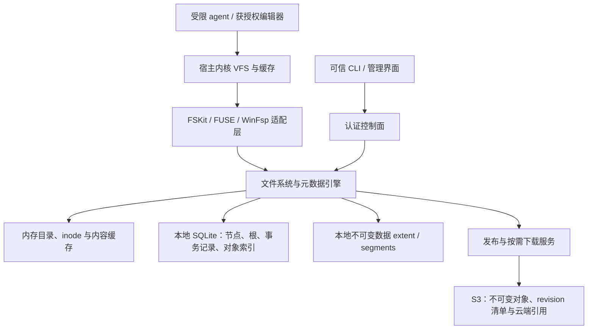

# forkfs 用户态版本化文件系统整体设计

日期：2026-10-08。状态：设计提案，尚未实现；FSKit 性能、平台安全边界和云端提交均需原型验收。

本文汇总本轮讨论，重点定义元数据服务。它是后续统一用户态核心的设计依据；
[`MACOS_FILESYSTEM_REDESIGN.md`](MACOS_FILESYSTEM_REDESIGN.md) 保留平台探索、原始测量和
绕过测试。本文与旧 [`arch.md`](../arch.md)、M1 目录后端设计冲突处，以本文的目标契约为准。
现有代码仍为目录 clone/reflink、SQLite 生命周期库和可选 FSKit 透传，不代表本文已落地。

## 1. 目标与关键决策

forkfs 将工作区呈现为真正的文件系统挂载。用户指定源目录和目标路径，由服务管理存储、
挂载、分叉、版本和清理；不要求用户分区、格式化或为每个 World 准备独立块卷。
Linux/XFS 也不以普通目录或仅对目录做 bind mount 作为新模式的 World。

核心模型是：**revision 固定一个不可变文件系统根，World 持有可移动的根引用，fork
共享已有根，修改通过 CoW 产生新节点和内容。** 数据布局可独立于宿主文件系统，未来可
将同一 revision 发布到 S3，让其他机器按需挂载。

| 决策 | 首版设计 |
| --- | --- |
| 元数据服务 | 本机常驻、可信的权威服务，管理一个 repository 中全部 World；不是每次 stat 访问云端 |
| 挂载前端 | Linux FUSE；macOS FSKit；Windows 评估 WinFsp。共享存储核心，各自验证语义、部署和性能 |
| 元数据结构 | 持久化 CoW B+tree 与不可变 inode 记录组成的 DAG；版本不靠层层查找父 World |
| 本地事务存储 | 首选原型使用 SQLite WAL 保存不可变元数据节点、可变根目录与对象索引；不是直接克隆数据库 |
| 数据存储 | 不可变内容 extent；本地追加写 segment 存放，S3 后端按对象持久化 |
| 分叉 | 从已持久化 revision 共享根，注册新 World 引用；活跃 World 先经过 checkpoint 屏障 |
| 多端 | 首阶段每 World 一个本机写者；跨机器通过发布 revision 和创建新 World 协作 |
| 云端 | 本地读写优先；显式区分本地已持久化和云端已发布，不把本地 fsync 当作上传完成 |
| 安全 | 私有存储身份、认证控制面、受限 agent 启动链；挂载本身不能阻止直接打开宿主路径 |

macFUSE 因安装负担已被用户排除；不要求恢复模式、安全策略降级或第三方内核扩展。
LKL 因复杂度排除当前集成；不完整移植 Btrfs、不引入 SPDK 作为首版运行依赖。
借鉴成熟系统的数据结构与恢复原则，复用事务组件；不承诺因此免除文件系统正确性工作。

本轮选择用户态引擎作为需要验证的统一核心方向，不代表已经推翻原生 APFS 映像的性能
基线。若 FSKit 极简原型仍不达标，应明确记录该统一路线在 macOS 受阻，再重新选择后端；
不得改用普通目录、macFUSE 或弱化持久性来宣称成功。

## 2. 架构与进程边界



“元数据服务”首先是逻辑上的权威角色，部署时不强制增加第二次逐操作 RPC：

- Linux：可信 FUSE daemon 可在同一进程链接元数据引擎，broker 用独立控制通道管理它。
- macOS：优先验证引擎在 FSKit 允许的服务进程内运行、直接持有受限存储句柄的方式。
  如果系统身份和扩展生命周期要求独立 daemon，明确测量额外 IPC；不能假定同进程可行。
- 多个前端访问同一 repository 时，必须只有一个权威写入协调者。扩展重启、多个挂载实例
  不得各自以旧缓存更新同一根。若 FSKit 无法承载这一部署方式，属于选型阻塞项。
- agent 不获得数据库、segment、S3 凭据或管理 socket；前端只获得其 World 的能力。

### 2.1 Linux、macOS、Windows 的复用边界

| 层 | 三平台共享 | 平台实现 |
| --- | --- | --- |
| 格式与算法 | inode/目录/extent 编码、CoW、revision/fork、引用回收、S3 对象与发布 | 与平台路径和 C/C++ ABI 解耦的规范字节编码 |
| 文件系统语义 | 原子变更集、句柄身份、持久性与根提交 | Linux FUSE、macOS FSKit、Windows WinFsp 回调与缓存协议 |
| 本地 storage adapter | 对象 API 与提交顺序 | 文件 I/O、同步屏障、目录持久化、锁、句柄寿命和错误映射 |
| 安全与安装 | 能力模型、私有 backing、禁止降级契约 | 服务身份、IPC 认证、受限进程环境、平台驱动/扩展安装 |

[WinFsp](https://winfsp.dev/doc/WinFsp-Design/) 提供 Windows 用户态文件系统接口，包含
内核文件系统驱动及用户态 DLL。Windows 不承诺零依赖安装，须验证其安装权限、平台
支持与许可；macFUSE 被排除也不能据此推导 WinFsp 已获性能或部署验收。
Windows 采用服务进程与适配层，不假定把 Linux FUSE 程序原样编译即可。

“通用”指共享引擎与可交换 revision，不指三平台所有文件行为完全相同。Windows 的
share mode、delete-pending、锁、reparse point/ADS 和安全描述符须有明确映射或拒绝规则。
POSIX uid/gid 不直接等同于 SID；repository 保存逻辑主体及必要原始属性，挂载策略映射
本地身份，未知主体默认拒绝特权访问。保留原始 ACL 字节不等于已在另一平台正确执行 ACL。
Windows 的受限执行边界需单独原型，不能把进程作业管理机制当作完整文件访问沙箱。

所有格式带版本、长度和边界校验，整数与字符串采用固定规范编码；不直接序列化宿主
结构体、fd、指针或路径。上传下载不会改变逻辑对象 hash。平台适配差异不允许修改已
发布 revision 的名字或权限来“修好挂载”，必要时拒绝并提供显式转换导入流程。

宿主 syscall 仍存在：冷读需要 pread，持久化需要写入和同步。收益来自用内存索引、
事务批处理和共享版本根减少逐文件透传，而不是宣称消除了所有内核访问。宿主页缓存命中
只省设备 I/O；引擎内存缓存命中才可能省后备 syscall；内核文件缓存命中还可能省前端回调。

## 3. 对象、身份与三种时间线

| 对象 | 语义 |
| --- | --- |
| Repository | 同一权限与对象共享域，持有格式版本、实例 ID、事务库及对象存储；首版不跨 repository 去重 |
| World | `world_id`、当前工作状态、最近 durable root、head sequence、base revision、mount generation |
| Revision | 不可变 manifest：root hash、父 revision ID、提交序号、格式版本、说明；指向精确内容 |
| FilesystemRoot | root inode ID、inode-map root、命名规则版本；不包含机器路径、fd、锁或上传状态 |
| Inode | 稳定逻辑 ID 与 generation，包含类型、权限、大小、时间戳、nlink、目录/extent/xattr 根 |
| Object | 类型和规范编码参与 hash 的不可变字节对象，可为元数据节点、inode 或内容块 |
| Session / Handle | World、mount generation、inode ID、访问模式、能力和运行期 pin；不属于 revision |

分开记录三种进度，不用一个“已保存”标志混淆：

1. `visible_seq`：已由引擎接受并对本 World 可见的操作，部分可能尚未持久化。
2. `durable_seq`：内容与元数据已按本地提交协议落盘，重启可恢复。
3. `published_revision`：其完整对象闭包已上传，并通过云端发布协议可被另一机器使用。

这些序号不是应用 syscall 的全局时钟；内核尚未下发的脏页不在服务已接受的操作中。
revision 不自动对应每个 write 或每次编辑器保存。命名 checkpoint、周期策略和事务提交
是不同概念；连续历史的保留频率、空间上限和用户可见保证必须显式配置。

## 4. 元数据 DAG：避免整树复制与父层查找

### 4.1 根与索引

```text
FilesystemRoot
  └─ inode_map_root：inode_id → immutable InodeRecord hash
        ├─ directory inode → dir_root：(name bytes) → inode_id + type hint
        ├─ regular inode   → extent_root：(logical offset) → content hash / range
        └─ inode           → xattr_root：(key) → value / object hash
```

目录项引用逻辑 inode ID，不直接引用 inode 版本。多个 hardlink 因而解析到同一 World
inode map 中的同一个 inode；写入 inode 只需更新该映射，而非搜索所有路径。
目录不支持 hardlink；跨 World rename/link 返回跨设备语义错误，不借共享内容绕过隔离。

所有持久化树节点不可变。修改复制受影响的路径，未变化子树继续共享。World A 与 B
共享根后，B 的 inode map 更新不会改变 A。版本读取直接从自己的完整逻辑树根查找，
不沿几百代父 revision 逐层解析；父链只用于历史和 ancestry。

文件可使用内联小 extent 表，增长后升级为树；稀疏范围显式表示 hole/zero，不引用
不存在对象。先用固定页大小和确定性编码做原型，再根据元数据与小文件负载选择扇出、
extent 粒度。4 KiB 写不应默认复制 1 MiB 内容；大文件采用多 extent，避免整体重写。
不先引入压缩、跨仓库去重或内容定义分块，以免同时增加恢复和性能变量。

### 4.2 名字与跨平台规则

repository 在创建时固定大小写与名字编码策略，revision 携带策略版本。首版建议大小写
敏感、合法 UTF-8 名字；无法无损导入的字节名必须列出并拒绝，不能静默转码或合并。
首版三平台可移植配置还要限制 Windows 不可表达的名字、保留名、尾随点/空格及大小写
冲突；仅 UTF-8 并不足够。可选择更宽松的原平台配置，但挂载到不兼容平台时先检测并拒绝。
如果采用更广的字节名支持，应先证明目标平台都能往返。ACL、xattr、symlink、执行位等
保留有版本的编码；遇到不能表达的安全语义必须失败，不能假装保留。

文件稳定身份以 `(world_id, inode_id, inode_generation)` 为内部标识，挂载层分配自身
node ID 并校验 mount generation。内容 hash 不作为 inode ID，复制文件也不因内容相同
而成为 hardlink。inode ID 不在旧句柄可能存活时复用。

### 4.3 工作态与不可变态

热路径通过内存 B+tree 节点缓存、inode 缓存和 dirty transaction overlay 工作。
单次文件操作先形成原子内存变更集，读者不会看见 rename 完成一半。一个持久化批次把
overlay 合并为新不可变路径并计算 hash；不要求每个字节写入立即生成命名 revision。
fork/revision 只能引用冻结后的根，不允许引用未来仍会原地修改的 dirty node。

### 4.4 分叉和第一次写的例子

假设 revision R 和 World A 都 pin 根 N0，N0 的 root 引用贡献为 2。fork 出 B 时只增加
B → N0，贡献变为 3，不把 N0 下的每个对象计数乘以 3。
B 修改文件后创建新 extent、inode 版本和 N1 路径。事务注册新节点的出边并把 B 的 pin
从 N0 移到 N1；N0 仍由 R/A 保留，共享子树同时受到新旧父节点的引用保护。最后删除
R/A 的 pin 后，N0 才有机会递归回收，共享子树因 N1 的边仍存活。

这是对象 DAG 的引用计数，不是“文件内容相同就合并 inode”，也不是修改原树后只把
旧根计数加一。持久化的 World 根不可原地覆盖其子对象。

## 5. 元数据服务接口与事务执行

数据操作按 inode/handle 定位，避免每个回调从 repository 根重新解析完整宿主路径。

```text
lookup(world, parent_inode, name) -> inode + attributes + cache_generation
getattr(world, inode) -> attributes
readdir(world, directory, cursor) -> entries + next_cursor
create / mkdir / unlink / link / rename / setattr / setxattr -> operation result
open(world, inode, flags) -> handle
read(handle, offset, length) -> bytes
write(handle, offset, bytes) -> accepted bytes + internal operation sequence
fsync(handle, mode) -> locally durable through the required boundary

checkpoint(world, expected_head, consistency_mode, request_id) -> revision
fork(revision, new_world, request_id) -> world
restore(world, revision, expected_head, request_id) -> new mount generation
publish(revision, remote_ref, expected_remote_version, request_id) -> publish receipt
```

协议字段必须包含 repository/World 能力、session epoch 和格式版本。调用者身份来自
操作系统认证通道；不信任请求里的 uid。请求 ID 用于有副作用控制操作的幂等重试。
数据面重试依赖适配层的请求生命周期，不能对所有 write 按字节内容盲目去重。

### 5.1 并发模型

- 每 World 有一个变更排序器，先按清晰的串行语义实现 rename、link 与根更新；不同
  World 的数据准备、读、hash 和下载并行。提交时校验 expected head 防止丢失更新。
- 数据 I/O 不占数据库写锁。读者 pin 一个一致视图；live 读合并已发布的内存变更集，
  revision 读只访问不可变节点。缓存项按对象 hash 或 World generation 区分。
- 首版每 repository 一个 SQLite 提交协调者；短事务批量提交已准备好的变更，不在事务
  内下载 S3 或扫描全树。SQLite 单写者是明确的伸缩风险，8/32 World 必须单独测。
- group commit 可以摊薄同步成本，但不能让 fsync 成功早于所需批次持久化；设队列上限、
  调度公平性和背压，防止构建流量饿死交互保存。

首版同 World 同时只开放一个可写挂载，会话内可以有多个应用进程；其他挂载读取固定
revision。多个 World 可以同时可写。若未来允许同 World 多个可写前端，必须先实现跨
前端缓存失效与同一写入序列，不能仅靠数据库串行提交声称 POSIX 一致。
目录 rename 在同一变更集里检查目标类型、非空目录、目录环与替换 inode 的 nlink/orphan
转移；文件锁与 Windows share mode 是运行期按 World/inode 管理的状态，不随 revision 复制。

### 5.2 缓存权威与资源预算

内容与不可变节点按 hash 缓存；可变属性和名字按 World/inode/目录 generation 缓存。
同一 daemon 是 live 元数据的唯一写入入口，导入、恢复及管理命令也不能在后台绕过
引擎改动 backing。固定 revision 可以使用长寿命只读缓存，live World 的属性/名字缓存
须配合平台失效通知及有界有效期；若前端缺少必要失效能力，限制相应管理操作，而非
在内核缓存仍有效时替换内容。页缓存的写回与 checkpoint 按 §7.2 单独协调。

LRU 淘汰只针对干净且无 pin 的节点和内容。dirty 事务、打开的 orphan、发布任务和
未上传数据分别计入预算；超过上限时提交、背压或返回容量错误，不能丢弃已接受状态。
冷 lookup 可能读取多个元数据页，不把“自管元数据”描述成所有请求永久零 I/O。

### 5.3 首版持久化表（逻辑 schema）

| 表 | 关键内容 |
| --- | --- |
| `worlds` | world ID、durable root、head seq、base revision、mount generation、状态 |
| `revisions` | revision ID、manifest、root hash；revision payload 不随上传状态改变 |
| `nodes` | hash、type、encoding version、immutable payload |
| `object_edges` | parent hash、child hash、multiplicity；对象实际拥有的强引用边 |
| `object_state` | hash、refcount、lifecycle、local presence、remote presence |
| `object_locations` | hash → segment ID、offset、length、checksum / remote key |
| `root_pins` | owner kind/ID → root/object；World、revision、事务、上传任务及会话 pin |
| `commits` | txid、World sequence 范围、request ID、结果；恢复和幂等依据 |
| `sessions_orphans` | 会话 epoch、open-unlink inode 与相关 pin；恢复时验证服务代次 |
| `gc_queue` | object、回收状态、重试信息；持久记录后台进度 |
| `publish_jobs` | revision、远端引用预期版本、对象上传进度、状态及错误 |

节点 payload 与引用边必须一致，边可从 payload 重建。更新根、添加新节点、注册边、
增加/减少 root pin、写入事务结果在同一个 SQLite 事务内完成。
SQLite 提供事务底座，CoW 版本树由 forkfs 显式实现；SQLite 的读事务快照不能直接充当
永久、可写 World 分支，也不为每次 fork 复制数据库。

WAL 与 `synchronous=FULL` 是初始持久化配置，打开后检查实际结果。目录同步、设备 flush
以及 macOS 的完整同步要求由平台 storage adapter 实现并做故障测试；不得只因选了 FULL
就声称整个外部 segment 协议已安全。WAL 位于本机，不放在 S3 或网络共享目录。
长读事务与 WAL checkpoint 要有界；SQLite checkpoint 与 World checkpoint 名称相近但
语义无关。依据见 [SQLite WAL](https://www.sqlite.org/wal.html) 与
[synchronous](https://www.sqlite.org/pragma.html#pragma_synchronous)。

## 6. 数据与元数据的提交顺序

内容对象采用规范的 `type + format + length + payload` hash，首版 SHA-256；对象读取
校验长度与 checksum/hash。对象 ID 与本地 segment 偏移分离，因此压平或迁移不改 revision。
不覆盖已发布 extent；segment 可追加，但已引用的字节范围不可变。

本地批次提交协议：

1. 固定 World 的操作边界 q，pin 旧根与该批次输入；为 dirty 内容分配新 extent，并生成
   新 inode、树路径和根。分配前预留保守的数据、元数据及回收应急空间。
2. 写入本地 segment，完成相关数据同步；新建 segment 的文件及目录入口也须持久化。
   记录该批次实际同步到的范围。准备工作可并行，但不能把别的尚未同步 append 算作安全。
3. 开启数据库事务，验证旧 head 与会话 epoch；写新节点、对象位置和边，注册新根引用，
   释放旧 World 根引用，推进 durable seq，登记请求结果；以 FULL 配置提交。
4. 确认提交成功后更新内存 durable 状态，返回 fsync/checkpoint 等等待者。普通操作的
   live 可见状态可以领先 durable 状态，但命名 revision 只能指向已提交根。

**先持久化内容，再提交引用内容的根。** 内容写成而元数据未提交只产生待清理垃圾；
元数据提交成功而内容丢失会破坏 revision，因此禁止相反顺序。
新元数据节点直接保存在同一次 SQLite 事务中，首版不额外发明第二个元数据 WAL。

普通 write 成功只承诺符合前端缓存语义的接受，不承诺断电后仍在；close 不自动等于
fsync。持久化错误必须传播给对应同步操作，并使受影响 World 进入明确的 I/O 错误状态，
不能静默回退旧内容继续写。提交结果不确定时按 txid 查询恢复，不能直接重复扣引用。

原型 fsync 可以提交同 World 已接受到 q 的完整批次以简化依赖跟踪；这比最小文件同步
更强且可能更贵，须计入保存尾延迟。目录项持久性另按目录 fsync/平台语义处理。
读权限检查、缓存与 atime 策略由挂载声明一致执行；不能用关闭安全或伪造同步来优化。
从云端导入的 World 可以仍引用只有远端副本的旧 extent；它们依靠远端 retention 保活。
这种模式的“本地持久化”保证新写入和引用记录恢复，不意味着完整文件已离线可用；
完整离线可用必须另外下载并 pin 内容闭包，CLI/status 应分别报告。

## 7. revision、fork、恢复与文件句柄

### 7.1 从已有 revision 分叉

单个元数据事务：验证 revision 可用及授权 → 新建 World → 新增 root pin → 记录幂等
结果。根节点的引用计数增加，内部子节点不用逐个增加，因为没有创建新的内部边。
已经完整登记元数据的远端 revision 可以共享根，内容仍按需获取；第一次导入远端 revision
用于可写 fork 时，首版先获取并验证其完整元数据 DAG，再原子注册本地根和引用边。
这一步可能随元数据规模增长，必须与后续常数规模的根引用操作分别报告；只读远端挂载
可以延迟获取元数据，其缓存与权威计数域的区别见 §8。

这使分叉的**元数据工作不随文件数逐项增长**；挂载、授权、缓存预热及底层数据库索引
仍有成本，不将“增加根引用”宣传为完整 fork 延迟。百万文件也不预遍历建一份 inode 表。

### 7.2 活跃 World checkpoint

必须区分服务收到请求的边界和应用已写入内核缓存的边界：

1. 阻止新写入进入即将封存的代次，并建立平台支持的写回/访问者协调屏障。
2. 排空屏障前在途请求及所需脏页，使 mmap、writeback、truncate 有明确顺序；不能
   仅暂停服务接收回调，否则可能堵死等待回调完成的内核刷新。
3. 执行 §6 持久化协议，发布不可变 revision；恢复父 World 写入，新写继续 CoW。
4. fork 活跃 World 时从该 revision 创建子 World；父子的运行期句柄、锁和能力不共享。

若前端尚不能提供可证明的屏障，只支持从已封存 revision fork，或要求受控访问者显式
同步并完成停写协议；不声称任意运行中应用的瞬时快照。内核脏页和活跃 mmap 的支持
必须在产品开放该能力前通过实测。文件系统一致性不等于应用多文件事务一致性。

### 7.3 hardlink 与 open-unlink

`nlink` 是同一 World 中目录项数量，不是对象引用计数。写 hardlink 对应的 inode，所有
同 World 名字看到同一更新；其他 World 保持自己的 inode 版本。
open handle 绑定逻辑 inode，不永久绑定打开时的内容 hash，因此同 World 后续修改可见。

最后一个名字删除后，如果 fd/mmap 或前端生命周期引用尚存，inode 转入 session orphan
集合并保持可读写；其数据由独立 pin 保活。orphan 不进入新 revision 的可达命名空间，
也不泄漏到 fork 子 World。最后一个有效引用关闭后再释放。崩溃恢复可回收已消亡服务
代次的 orphan；存在性必须来自会话握手和存活状态，不能仅靠 PID 数值或固定 TTL。

### 7.4 restore

恢复不是把活跃 fd 指向任意历史内容。首版要求停止并释放该 World 的访问者，撤销挂载
代次后切换 root，再以新 generation 挂载；旧句柄返回明确失效或断连错误。
如果无法可靠失效旧 fd/mmap，则拒绝在线 restore。以后支持保持打开句柄的在线分支切换，
需另立契约，不塞进简单的根指针赋值。

### 7.5 diff、历史与 Git

diff 从两个根开始，对 hash 相等的子树直接跳过，比较变化的目录、inode 属性及 extent
映射；hash 不等时继续比较，不能直接把整个子树判为不同。每次提交可记录 changed-inode
集合加速相邻版本比较，但日志只是辅助索引，不替代树的事实来源；缺日志时仍能完整比较。
rename 可利用稳定 inode 识别，但 hardlink 的多个路径、跨 World 独立新建对象以及
目录移动需要单独表示。树重平衡和元数据变化会扩大比较工作，不承诺所有 diff 都严格
O(用户修改文件数)。

revision 保存挂载命名空间中的文件系统状态，不保存进程、锁或终端会话，也不等于 Git
commit。受管理的 `.git` 与子模块内容若在命名空间内，按相同一致性规则保存；不能擅自
排除后仍声称完整工作区恢复。现有 Git 管理约束在迁移时逐项对照，导出到宿主仓库和
创建 Git commit 仍是独立授权操作。文本合并或多分支语义合并不属于首版元数据服务。

## 8. 引用计数与垃圾回收

### 8.1 计数定义

`refcount(object) = 已登记 root pins + 存活不可变父对象指向它的强边数量`。
同一父对象被引用十次，其出边只登记一次；创建新的 CoW 父节点时，才为它的每条出边
增加计数。边有 multiplicity，不能错误地把同一子对象的多条边合成一个引用。

root pins 覆盖 World durable roots、保留 revision、在途事务、读取视图、open-unlink、
发布/导入任务和显式 retention。运行期短 pin 可用内存 epoch 管理，但 GC 必须同时考虑
它们；需要跨崩溃恢复的 pin 必须持久化。创建引用与 GC 状态变化由同一协调者串行化。

live dirty overlay 也属于保活集合：它复用的旧节点、尚未提交的新内容和快照读句柄都
必须在释放旧 root pin 前取得对应事务/runtime pin。引用获取与 GC 重验不可有空窗，
不能先返回裸对象地址再补 pin；仅保护 durable root 不足以保护后续内存变更。

首版不对只下载了部分元数据的远端树计算“完整本地引用计数”。只读远端视图保留远端
revision 的 retention 引用，本地按 hash 缓存的节点作为可驱逐副本，不加入权威 GC 域。
转为可写本地 World 前，先完整验证元数据 DAG 并注册全部边（内容可以仍是已验证的
远端位置记录），完成导入事务后才发布本地根；大型导入用带 pin 的 staging 域分批处理，
最终事务切换为可见，不暴露半棵树。部分导入失败时可恢复或安全清理 staging。

revision 的父 ID 默认表示 ancestry，不自动永久保住全部祖先内容。内容保留由显式
retention pin 决定；释放后该历史版本显示“内容已回收”，不能仍允许成功挂载。用户固定
的 revision 禁止自动释放。diff 遇到已回收版本应明确失败。

### 8.2 增量本地 GC

1. 计数变零时事务性加入队列；不要在 unlink/fork 热路径递归删除整棵树。
2. worker 在事务内重验 refcount、runtime pins 与 lifecycle，标记回收，删除对应出边
   并逐步减少子对象引用；每个批次可恢复、可重试，不能重复减少同一条边。
3. 活跃对象与回收对象不能并发重新引用。重新使用已回收 hash 必须走完整对象注册和
   内容校验，而不是对不存在的对象直接加一。已排队但尚未回收的对象可在事务内救活。
4. 逻辑对象回收与 segment 物理空间回收分开。segment 混有存活 extent 时复制存活范围、
   同步新 segment，事务更新 location；等旧读者退出 epoch 后才删除旧 segment。

维护可从 root pins 和不可变 payload 遍历重建的 reachability 校验，定期对比计数。
发现计数下溢、缺对象、节点损坏或遍历读取失败时停止破坏性 GC，优先保留数据。
不能把数据库读取失败当作“没有引用”。

下载到本地的远端对象可以仅驱逐本地副本，前提是远端对象已验证且不属于未上传写入。
这与删除全局对象不同。用户声明离线可用的 revision 必须把完整所需闭包保存在本地并
持有离线 pin；仅有根缓存不代表离线可挂载。

## 9. S3：对象存储与发布协议

### 9.1 数据布局与缓存

```text
repositories/<repo>/objects/<type>/<hash>    不可变节点与内容
repositories/<repo>/revisions/<revision>    不可变 manifest
repositories/<repo>/refs/<branch>           可变云端 head / generation
```

首阶段以正确性为先逐对象上传，不把本地 segment 的机器偏移写入远端 manifest。
大量小对象的请求费用和冷启动延迟是明确风险；后续可用不可变 pack + 索引合并传输，
但对象逻辑身份保持不变，并单独处理 pack GC 和 range read。元数据 LRU、目录预取、
内容缓存、在途下载合并与校验用于避免 Git/build 每次 syscall 请求 S3。

已有本地干净缓存可在离线时读取；未缓存的远端内容返回明确网络/数据不可用错误，
不能伪造 hole 或 ENOENT。离线修改只能在所需旧数据可获取时进行；离线 fork 不宣称
其他机器已经可见。缓存与未发布写入在配额上分开，前者可淘汰，后者不能擅自丢弃。

### 9.2 发布状态机

```text
LOCAL_DURABLE → UPLOADING → OBJECTS_READY → REF_COMMITTED → PUBLISHED
                       ↘ 可重试失败           ↘ 冲突，保留本地 revision
```

1. 对 revision 加 publish pin，持久化任务 ID 和预期远端 head；冻结其完整对象闭包。
2. 上传缺失内容与元数据对象，校验长度/摘要；同 hash 对象采用条件创建或验证已有对象。
   S3 ETag 仅作为条件更新令牌，不能普遍当作内容 MD5/hash。
3. 上传不可变 revision manifest。只有其全部依赖都确认可用，才允许发布 head。
4. 对远端 ref 执行带预期版本的条件写。成功是云端分支发布点；冲突不得盲目覆盖或
   自动重新绑定到新 head。读取当前 ref，向用户返回冲突，保留自己的 revision 可另建分支。
5. 保存发布回执，再标记本地 PUBLISHED、解除任务 pin。响应丢失时通过任务 ID、revision
   和云端 generation 对账，不重复推进 head。

远端 ref 建议包括 `{revision, generation, writer_epoch, request_id}`，generation 单调
增加，避免 ABA。对象上传成功而 head 未更新只产生可清理对象；不能出现 head 已更新但
对象仍在后台上传的状态。S3 单对象条件写不提供跨对象事务，这就是先上传闭包的原因。
参考 [S3 条件写](https://docs.aws.amazon.com/AmazonS3/latest/userguide/conditional-writes.html)
与 [S3 一致性模型](https://docs.aws.amazon.com/AmazonS3/latest/userguide/Welcome.html#ConsistencyModel)。
“S3 兼容”服务必须实际验证这些能力；缺少必要条件写时要求独立协调服务，不能静默退化
成 last-writer-wins。不得把本地 SQLite 文件上传后就称作可并发云端元数据服务。

### 9.3 多端写入边界

首阶段：同一 World 只有一个本机写者；另一机器挂载已发布 revision 只读，或 fork 为
不同 World 后写入。不提供自动跨机器接管同一个可写 World。离线写入产生独立分支，
由显式发布/冲突处理衔接，不承诺自动文件合并。

后续若允许共享云端 World 的写者迁移，增加小型协调服务：认证 writer、持有 lease、
分配单调 fencing epoch，并在每次 head 提交时拒绝旧 epoch。服务校验与实际 ref 更新
须共同序列化，不能校验后留出接管竞态；禁止客户端绕过服务直接改 head。
租约超时、客户端时钟或一个 S3 lock 文件本身不足以阻止旧写者继续提交。断网旧写者
只能保留本地分支，恢复连接后重新获取授权，不可覆盖新写者。

### 9.4 云端 GC

首版关闭远端物理删除，只提供对象占用统计和清理 dry-run；本地 GC 不推导全局无引用。
各机器可能保留云端 revision、正在上传或长期离线，不能用本机 refcount 删除 S3 对象。

启用远端 GC 前必须有权威 retention catalog，覆盖已发布 roots、远端保留 revision、
导入/发布 pins 和需要远端内容的读者。保守首实现采用 repository 维护屏障：暂停新的
发布/引用变更，排空或持久登记在途上传，固定 catalog 代次做可恢复的 mark/sweep；
期间禁止注册可能指向待删对象的新引用。删除状态与 catalog 联动并验证对象版本，
完整结束后释放屏障。宽限期不能替代该并发协议；未来并发 GC 另行设计 epoch/pin 协议。

## 10. 权限、隔离和失效

文件操作检查 POSIX 权限/ACL，同时验证挂载绑定的 World 能力；知道 inode、hash、
World ID 或存储路径不构成授权。元数据 daemon 可以管理很多 World，但请求不能自行
切换 World。元数据改动不能构造指向宿主绝对路径的特权 I/O；symlink 在调用者权限下解析。

私有 repository 及其父目录、配置、服务程序和凭据属于 agent 无法控制的身份；不能
仅靠同 UID 的 0600 或隐藏路径名保护。禁止 agent 获得后台 fd、原始设备和管理代理。
通过受控启动器的全部后代必须继承限制；已在宿主无约束运行的外部 agent 不在承诺范围。

挂载点下层及父目录由可信方持有，服务退出或卸载不能留下 agent 可写普通目录窗口。
前端连接失效时返回明确 I/O 错误并撤销会话，不降级到 backing。内核缓存可能仍可服务
部分已授权读，因此“停止 daemon”不等于立刻撤销全部访问；完整撤销须同时处理进程、
fd、mmap 与挂载代次。平台安全测试继承平台调研文档中的绕过矩阵。

S3 凭据仅在可信同步进程中使用，权限限制在 repository 前缀；GC 删除权限与一般上传
权限分开。hash 校验解决内容完整性，不等于访问控制或加密。客户端加密与密钥轮换作为
单独能力设计，首版不宣传端到端加密，也不进行跨租户内容去重。

## 11. 故障恢复与容量

| 故障点 | 必须恢复到的状态 |
| --- | --- |
| segment 写一半、SQLite 未提交 | 上一个 durable root 有效；未登记尾部可回收 |
| 数据已同步、数据库提交失败 | 根不前进；新对象是受任务/恢复流程管理的垃圾 |
| 数据库已提交、回复前崩溃 | 依据 txid/请求 ID 返回原结果；不再扣一次引用 |
| 引用 GC 中途退出 | 从事务化队列续跑，不重复释放出边 |
| segment 压缩搬迁中途退出 | location 指向已同步副本；旧副本延迟回收 |
| 上传部分完成 | root 不发布，任务可重试；本地内容与 pin 保留 |
| 云端 head 成功、回执丢失 | 查 ref 和请求 ID 对账，不误判上传失败后删除对象 |
| ENOSPC / 配额耗尽 | 不发布缺内容的根，保留已有 revision；同步操作报告失败 |
| 校验失败 / 元数据不可读 | 挂载失败或明确 EIO，停止破坏性 GC；不以空树替代 |

repository 启动先恢复数据库、校验格式及根状态、重建必要 pins，并隔离损坏范围后再挂载。
不要求每次启动遍历所有内容对象；后台 scrub 验证完整 DAG，挂载读取时仍逐对象校验。
对象格式升级采用版本号和显式迁移，旧服务遇到未知写入格式拒绝打开。

配额同时报告逻辑字节、独占/共享估算、本地缓存、未上传数据和远端保留量；不能把
refcount 乘对象大小当作物理占用。设置最低应急空间，保证错误记录、GC 进度和恢复可写。
缓存驱逐、GC 与持久化带宽分别限流，World 之间不能因一个发布或大构建无限排队。

## 12. 性能预算与验证顺序

现有 FSKit Handler 透传测量显示元数据往返昂贵，不能外推为自管引擎的已证实上限，
也不能忽略：[`FSKIT_HANDLER_API_MACOS27.md`](FSKIT_HANDLER_API_MACOS27.md)。
原生 APFS 映像的约 215–243 ms 挂载中位数来自五轮小探针，仅作为对照。

沿用平台设计中的完整负载门槛：编辑保存 p95 ≤ 10 ms；增量 build/test 相对 native
≤ max(1.25 倍, native + 100 ms)；安装/大量生成文件 ≤ max(2 倍, native + 100 ms)；
已有 World 挂载 p50 ≤ 300 ms、p95 ≤ 400 ms。它们都是目标，不是已实现指标。

另为元数据服务建立以下测量：

| 阶段 | 测量内容 | 要回答的问题 |
| --- | --- | --- |
| 引擎内存 API | lookup/create/rename/unlink、10k/50k/1M entries | 数据结构和锁成本，不含前端与持久化 |
| FSKit/FUSE 内存后端 | 缓存命中/未命中、回调数、调度时间 | 平台前端的最低可行成本；失败则不继续重投入 |
| 本地持久化 | 同口径 fsync、group commit、元数据页和内容写放大 | SQLite/segment 能否兑现延迟与持久性 |
| revision fork | 同一根的 1/100/1000 个 World、第一次 CoW 写 | 元数据分叉与完整挂载成本分别报告 |
| 活跃 checkpoint | 多写者、mmap、rename、open-unlink 并发 | 屏障是否可靠，以及停写尾延迟 |
| S3 | 冷挂载、热缓存、离线、重试、publish 冲突 | 请求数、流量、缓存命中和云端可用时间 |
| 并发与维护 | 8/32 active、1000 idle，GC/压平/上传并行 | 单写者与队列是否限制吞吐和交互延迟 |

fork 的根引用事务与脏数据 checkpoint、平台挂载、隔离探针分别计时，不能以其中最快
的一项替代用户等待时间。所有性能对照采用一致缓存和持久化保证；样本不足不报告 p95。
参照已有采样脚本保留原始数据，但新引擎需要单独实现探针，不能复用旧目录结果当作证据。

## 13. 实施阶段与交付门槛

1. **前端成本实验**：小型内存 inode/目录实现，同时比较 FSKit、Linux FUSE 和原生基线。
   不改默认后端；先确认目标机器和部署策略下真实挂载可用、代价可接受。
2. **本地元数据核心**：实现规范编码、CoW 树、稳定 inode、SQLite 原子根提交和私有内容
   extent；完成 hardlink/open-unlink、fsync、崩溃注入、计数重建和 ENOSPC 测试。
3. **本地 World 生命周期**：revision、fork、diff、挂载能力、受控 checkpoint/restore、
   session orphan 与回收；通过 Git/build 和绕过矩阵后才开放受保护模式。
4. **S3 不可变 revision**：上传闭包、条件发布、只读远端挂载、按需下载、本地独立分支。
   远端物理 GC 保持关闭；验证失败重试和发布冲突。
5. **后续优化**：小对象 pack、缓存策略、并发控制、远端 retention/GC、可选写者迁移。
   是否拆分数据库或更换事务组件由实测决定，不先引入分布式元数据集群。

导入旧 World 时停写或取得可信快照，复制内容及元数据到新 repository，验证文件清单、
hardlink、ACL/xattr 与 hash 后发布首个 revision。旧 store 保留供恢复，不原地改格式；
迁移失败不损坏旧数据。Linux 旧目录后端和 macOS 原生映像可继续作为独立基线与导入源，
但不能把其不同历史/安全保证混在同一个“新模式已支持”的声明里。

## 14. 尚待决定与当前边界

- FSKit 引擎部署与权限模型能否避免额外逐操作 IPC；内存后端性能是否足够好。
- 活跃 mmap/写回的 checkpoint 屏障在各平台上能否成立；否则限制活跃 checkpoint。
- Windows WinFsp 的安装、权限、名字/ACL 与共享打开语义尚未验证；目前不是已支持平台。
- SQLite 单写者是否满足多 World；页大小、extent 粒度、批次窗口需用真实负载选择。
- 平台 ACL/名字规则的共同子集与明确失败行为；不以“跨平台”掩盖元数据损失。
- 远端 pack、加密、自动合并和写者迁移不属于首版本地核心；各有独立协议与验收。

本文确定元数据与提交模型，尚未证明目标性能或完整 POSIX 支持。现阶段交付是可审阅的
架构与验证顺序；后续实现必须把这些状态区分保留到 CLI/status 和错误信息中。
